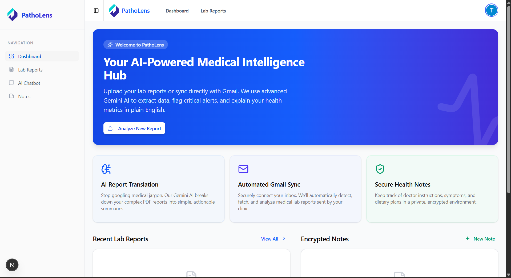
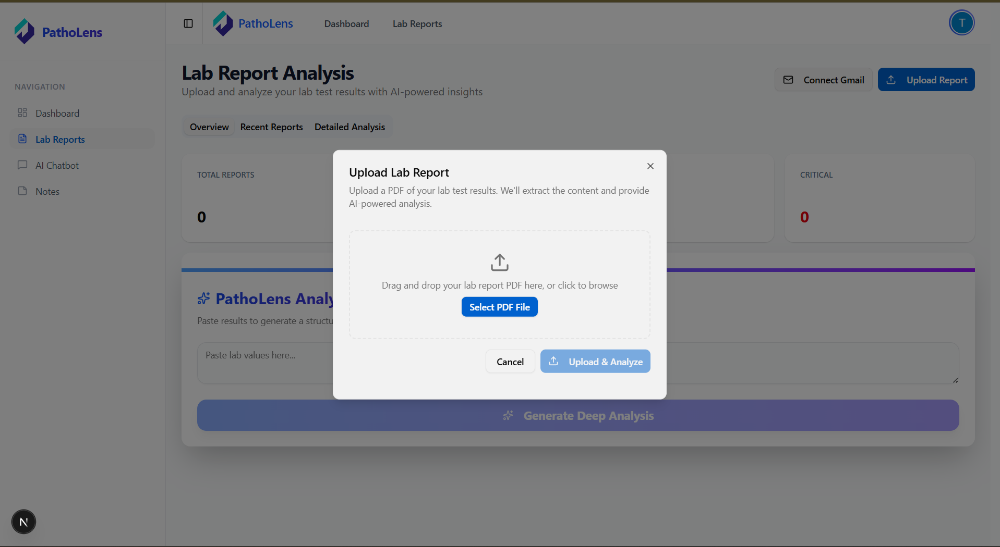
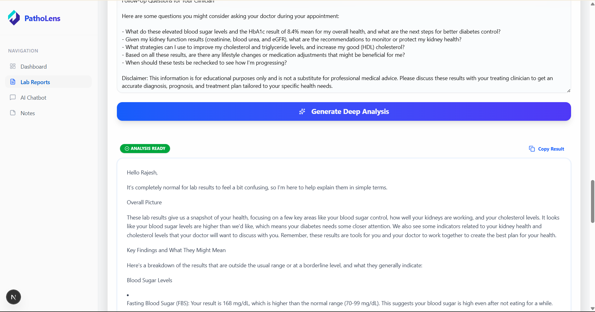
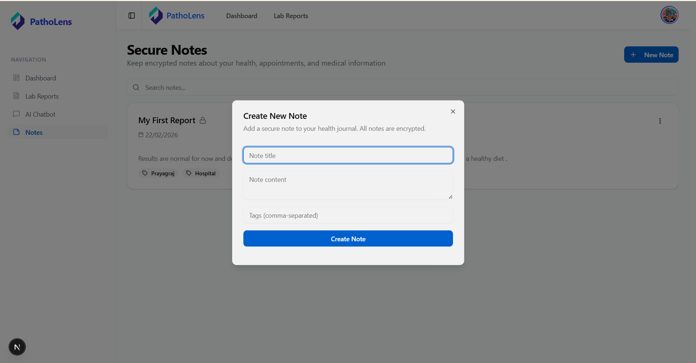

# 🩺 PathoLens – AI-Powered Medical Lab Report Analyzer

### Strategic Intelligence for Patient Health Data

PathoLens transforms complex, jargon-heavy medical lab reports into clear, actionable, and structured insights using state-of-the-art Generative AI.

---

##  Project Title

**PathoLens – AI-Powered Medical Lab Report Analyzer**

##  One-Line Description

An intelligent health platform that deciphers clinical lab reports into plain English using Gemini AI and Supabase.

##  Live Demo Link

[View Live Project](https://www.google.com/search?q=https://your-patholens-link.vercel.app)

##  Preview Section

<div style="margin-bottom: 40px; text-align: center;">
  <p><b>Dashboard & Navigation</b></p>
  
</div>

<div style="margin-bottom: 40px; text-align: center;">
  <p><b>Upload Report</b></p>
  
</div>

<div style="margin-bottom: 40px; text-align: center;">
  <p><b>Get AI powered Lab Report Analysis</b></p>
  
</div>

<div style="margin-bottom: 40px; text-align: center;">
  <p><b>Previous Lab Reports</b></p>
  
</div>

##  Problem Statement

Medical lab reports are filled with technical abbreviations and numerical ranges that are difficult for patients to interpret, often leading to unnecessary anxiety or missed health markers.

##  Solution Overview

PathoLens provides a secure "Medical Vault" where users upload reports. The system uses **Gemini 1.5 Flash** to extract raw data, categorize results (Normal/Critical), and provide a conversational interface for personalized health queries.

##  Key Features

* **Smart Data Ingestion:** PDF/Image parsing and direct Gmail sync.
* **AI Analysis:** Automated biomarker extraction and range validation.
* **Contextual Health Chat:** Ask questions directly to your specific report.
* **Trend Tracking:** Monitor changes in your health markers over time.

##  User Benefits

* **Clarity:** Understand blood work without needing a medical degree.
* **Speed:** Instant summaries before your doctor's appointment.
* **Security:** Complete data isolation using Supabase RLS.

##  Tech Stack

* **Frontend:** Next.js 14, Tailwind CSS, Framer Motion
* **Backend:** Supabase (Auth, DB, Storage)
* **AI Engine:** Google Gemini 1.5 Flash
* **UI Components:** Shadcn/UI, Lucide React

## Architecture Overview

Client → Next.js API → Gemini AI → Supabase DB

##  Folder Structure

```text
├── app/                # App Router (Pages & API)
├── components/         # UI Components (Blue/White Theme)
├── lib/                # Supabase & AI Config
└── public/             # Assets & Screenshots

```

##  Installation Steps

```bash
git clone https://github.com/gs27304/PathoLens.git
npm install
npm run dev

```

##  Environment Variables

```text
NEXT_PUBLIC_SUPABASE_URL=...
NEXT_PUBLIC_SUPABASE_ANON_KEY=...
GOOGLE_GEMINI_API_KEY=...

```

##  API Design

The `/api/analyze` route handles PDF text extraction and sends structured prompts to Gemini for JSON-formatted medical responses.

##  Security Considerations

Server-side AI calls prevent API key exposure. Supabase Row Level Security (RLS) ensures users only access their own reports.

##  Engineering Highlights

* Optimized for **Blue/White Clinical Theme**.
* Scroll-triggered animations using Framer Motion.
* Optimistic UI updates for seamless report deletion.

## Future Improvements

* OCR for handwritten notes.
* PDF export for doctor visits.
* Predictive health trend graphing.

##  Screenshots Section

*(See Preview Table in Section 4)*

##  Demo GIF

##  Author Section

**Gajendra Singh**

* **GitHub:** [gs27304](https://www.google.com/search?q=https://github.com/gs27304)
* **LinkedIn:** [Gajendra Singh Profile](https://www.linkedin.com/in/gajendra-singh-006a11219/)

