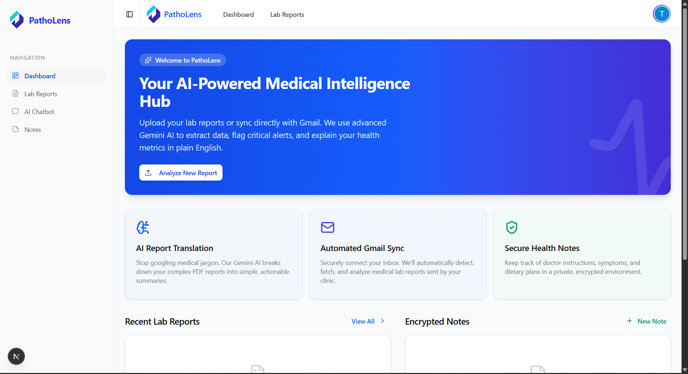
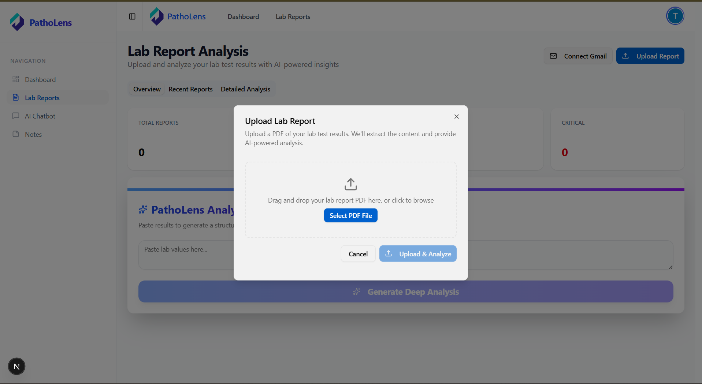
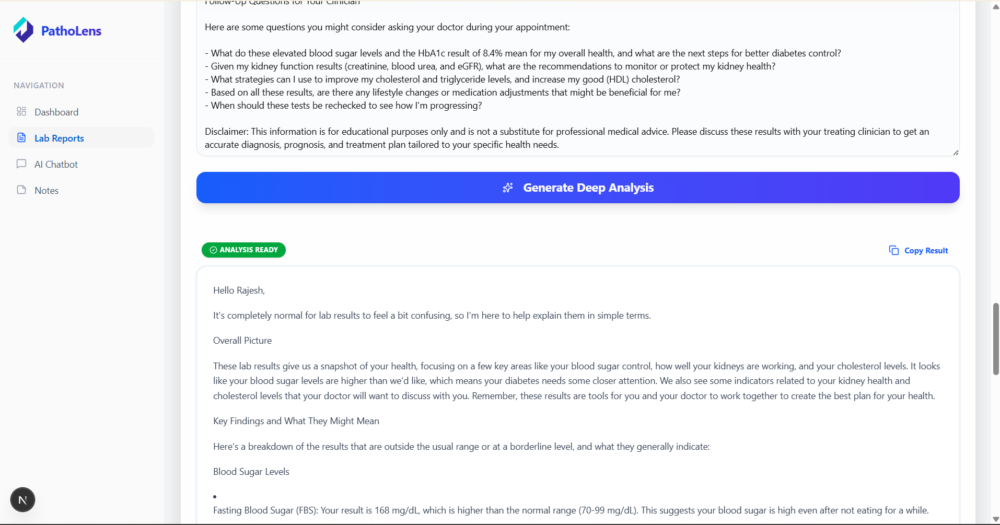
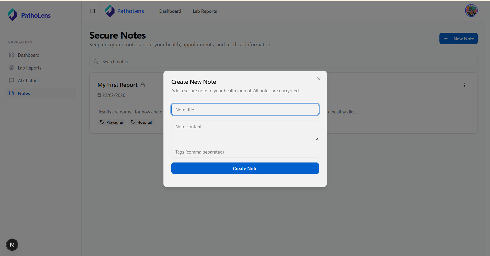
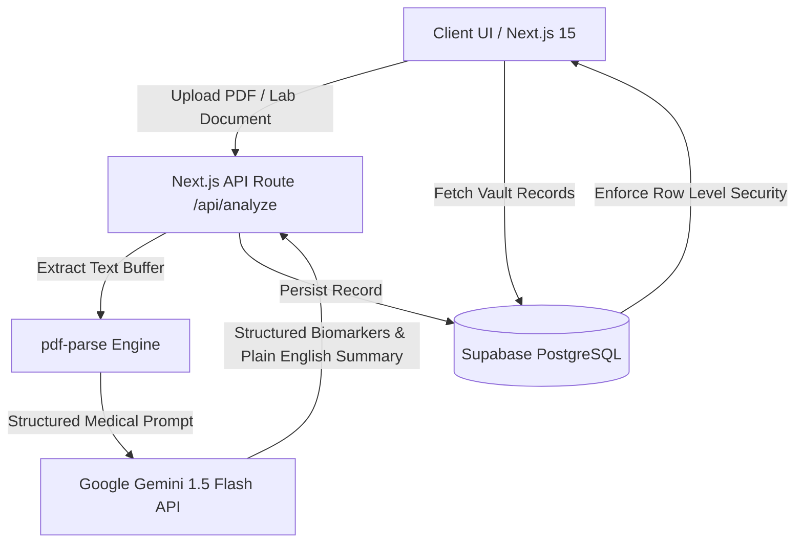

<div align="center">

  <h1>🩺 PathoLens</h1>
  <h3>AI-Powered Medical Lab Report Analyzer & Health Vault</h3>

  <p><i>Transforming complex, jargon-heavy medical lab reports into clear, actionable, and structured health insights using state-of-the-art Generative AI.</i></p>

  <p>
    <a href="https://medical-report-ai-nu.vercel.app/" target="_blank">
      
    </a>
    
    
    
    
    
  </p>

</div>

---

## 📌 Table of Contents

- [Overview](#-overview)
- [Key Features](#-key-features)
- [Application Preview & Screenshots](#-application-preview--screenshots)
- [System Architecture](#-system-architecture)
- [Tech Stack](#-tech-stack)
- [Database Schema & Security](#-database-schema--security)
- [Getting Started](#-getting-started)
- [Environment Variables](#-environment-variables)
- [API Reference](#-api-reference)
- [Security & Privacy Safeguards](#-security--privacy-safeguards)
- [Future Roadmap](#-future-roadmap)
- [Author & Connect](#-author--connect)

---

## 🔬 Overview

Medical lab reports are traditionally crammed with technical clinical terms, complex numerical reference ranges, and abbreviations that leave patients confused or anxious. **PathoLens** bridges this gap by providing a secure, intelligent platform that ingests medical reports, extracts raw laboratory data using AI, and translates complex biomarkers into plain, patient-friendly health summaries.

With **PathoLens**, users can:
- **Demystify Lab Work:** Quickly understand blood panels, lipid levels, and biomarker metrics prior to physician appointments.
- **Centralize Health Data:** Securely store and organize lab history in an isolated digital **Medical Vault**.
- **Ask AI Questions:** Engage with an interactive health assistant trained to provide context grounded directly in their uploaded report.

---

## ✨ Key Features

- 📑 **Smart Report Ingestion & PDF Parsing:** Instantly parse raw PDF lab reports using efficient node-based buffer extraction.
- 🧬 **Automated Biomarker Breakdown:** AI-driven analysis automatically categorizes biomarkers (Normal, Borderline, or Critical) with clear explanations.
- 💬 **Contextual Health Assistant:** Ask follow-up health questions directly to Gemini 1.5 Flash, scoped specifically to your report.
- 🔐 **Encrypted Medical Vault & Health Notes:** Maintain personal medical notes, doctor recommendations, and symptom logs with row-level data isolation.
- 🔒 **Enterprise-Grade Data Protection:** Powered by Supabase Auth with Row Level Security (RLS), guaranteeing complete user data privacy.
- 🎨 **Clinical Blue/White Theme:** Responsive, modern design aesthetic crafted with Next.js 15, Framer Motion, and Tailwind CSS.

---

## 📸 Application Preview & Screenshots

> [!NOTE]
> All primary interfaces of **PathoLens**—from overview dashboards to AI report analysis and historic vault storage—are previewed below.

<div align="center">

### 1. Dashboard & Navigation Overview

<p><i>Clean clinical overview showcasing recent report history, quick upload triggers, and health metrics.</i></p>

<br/>

### 2. Lab Report Upload & Processing

<p><i>Drag-and-drop report ingestion interface supporting instant file parsing and validation.</i></p>

<br/>

### 3. AI-Powered Biomarker Analysis

<p><i>Structured breakdown of lab values, risk indicators, and comprehensive plain-English summaries.</i></p>

<br/>

### 4. Historical Medical Vault & Lab Reports

<p><i>Centralized archive for accessing past lab analyses, health notes, and historical data trends.</i></p>

</div>

---

## 🏗️ System Architecture


```mermaid
graph TD
    A[Client UI / Next.js 15] -->|Upload PDF / Lab Document| B[Next.js API Route /api/analyze]
    B -->|Extract Text Buffer| C[pdf-parse Engine]
    C -->|Structured Medical Prompt| D[Google Gemini 1.5 Flash API]
    D -->|Structured Biomarkers & Plain English Summary| B
    B -->|Persist Record| E[(Supabase PostgreSQL)]
    A -->|Fetch Vault Records| E
    E -->|Enforce Row Level Security| A
```

---

## 🛠️ Tech Stack

| Domain | Technology / Library | Description |
| :--- | :--- | :--- |
| **Framework** | [Next.js 15 (App Router)](https://nextjs.org/) | React server components, Turbopack, and high-performance API routes |
| **Language** | [TypeScript 5](https://www.typescriptlang.org/) | Full-stack end-to-end type safety |
| **Styling** | [Tailwind CSS 4](https://tailwindcss.com/) & [Shadcn UI](https://ui.shadcn.com/) | Clinical blue & white responsive UI design system |
| **Animations** | [Framer Motion](https://www.framer.com/motion/) | Smooth layout transitions and interactive UI feedback |
| **AI Engine** | [Google Gemini 1.5 Flash](https://ai.google.dev/) | High-speed structured medical analysis and contextual Q&A |
| **Database & Auth** | [Supabase](https://supabase.com/) | PostgreSQL database, Auth integration, and Row Level Security |
| **Document Processing**| `pdf-parse` | Server-side PDF document buffer parsing engine |
| **Iconography** | [Lucide React](https://lucide.dev/) | Clean, accessible clinical vector icons |

---

## 🗄️ Database Schema & Security

PathoLens utilizes PostgreSQL on **Supabase** with strict **Row Level Security (RLS)** policies enabled to ensure that authenticated users can only access their own clinical records.

### `lab_reports` Table
```sql
CREATE TABLE lab_reports (
  id UUID DEFAULT gen_random_uuid() PRIMARY KEY,
  user_id UUID NOT NULL REFERENCES auth.users(id) ON DELETE CASCADE,
  file_name TEXT NOT NULL,
  raw_text TEXT NOT NULL,
  structured_data JSONB,
  ai_analysis TEXT,
  uploaded_at TIMESTAMP WITH TIME ZONE DEFAULT NOW(),
  created_at TIMESTAMP WITH TIME ZONE DEFAULT NOW(),
  updated_at TIMESTAMP WITH TIME ZONE DEFAULT NOW()
);
```

### `notes` Table
```sql
CREATE TABLE notes (
  id UUID DEFAULT gen_random_uuid() PRIMARY KEY,
  user_id UUID NOT NULL REFERENCES auth.users(id) ON DELETE CASCADE,
  title TEXT NOT NULL,
  content TEXT NOT NULL,
  tags TEXT[],
  encrypted BOOLEAN DEFAULT FALSE,
  created_at TIMESTAMP WITH TIME ZONE DEFAULT NOW(),
  updated_at TIMESTAMP WITH TIME ZONE DEFAULT NOW()
);
```

---

## 🚀 Getting Started

Follow these steps to run **PathoLens** locally on your machine.

### Prerequisites
- **Node.js**: `v18.x` or higher
- **npm** or **pnpm**
- **Supabase Account**: For database and authentication setup
- **Google Gemini API Key**: Available via [Google AI Studio](https://aistudio.google.com/)

### Installation Steps

1. **Clone the Repository**
   ```bash
   git clone https://github.com/gs27304/PathoLens.git
   cd "medical report"
   ```

2. **Install Dependencies**
   ```bash
   npm install
   ```

3. **Database Setup**
   Execute the SQL statements provided in [`schema.sql`](schema.sql) in your Supabase SQL Editor.

4. **Environment Configuration**
   Create a `.env.local` file in the root directory (see format below).

5. **Start the Development Server**
   ```bash
   npm run dev
   ```
   Open [http://localhost:3000](http://localhost:3000) in your browser.

---

## 🔑 Environment Variables

Create a `.env.local` file in the project root containing the following variables:

```env
# Supabase Database & Auth Configuration
NEXT_PUBLIC_SUPABASE_URL=https://your-supabase-project.supabase.co
NEXT_PUBLIC_SUPABASE_ANON_KEY=your-supabase-anon-key

# Google Gemini AI Integration
GOOGLE_GEMINI_API_KEY=your-google-gemini-api-key

# Scalekit SSO Integration (Optional)
SCALEKIT_ENVIRONMENT_URL=your-scalekit-env-url
SCALEKIT_CLIENT_ID=your-scalekit-client-id
SCALEKIT_CLIENT_SECRET=your-scalekit-client-secret
```

---

## ⚡ API Reference

### `POST /api/analyze`
Processes uploaded lab document files and returns structured AI-derived clinical metrics.

- **Request:** `FormData` containing the target PDF or text document.
- **Workflow:**
  1. Extract document text using `pdf-parse`.
  2. Build a structured medical extraction prompt for Google Gemini 1.5 Flash.
  3. Receive schema-validated JSON containing biomarker classifications and health summaries.
  4. Automatically store the result in the `lab_reports` Supabase table for the logged-in user.

---

## 🛡️ Security & Privacy Safeguards

- **Server-Side Execution:** AI operations and external API requests run strictly on the server to prevent exposing client keys.
- **Row-Level Security (RLS):** Supabase database policies isolate user reports, preventing unauthorized access across accounts.
- **Data Isolation:** User health data is never shared or published publicly.

---

## 🔮 Future Roadmap

- [ ] **Handwritten Note & OCR Support:** Scan handwritten doctor notes and legacy paper forms.
- [ ] **Doctor Brief PDF Export:** Generate one-page executive summaries formatted specifically for physician consultations.
- [ ] **Longitudinal Trend Graphs:** Interactive charts tracking key biomarkers over multiple years.
- [ ] **Multi-Profile Family Vault:** Securely manage lab reports for dependents or family members.

---

## 👨‍💻 Author & Connect

**Gajendra Singh**

- 🚀 **Live Demo:** [PathoLens Web Application](https://medical-report-ai-nu.vercel.app/)
- 💻 **GitHub:** [@gs27304](https://github.com/gs27304)
- 💼 **LinkedIn:** [Gajendra Singh Profile](https://www.linkedin.com/in/gajendra-singh-006a11219/)

---

<div align="center">
  <p><i>Empowering patients with clear, accessible, and intelligent health data.</i></p>
</div>
